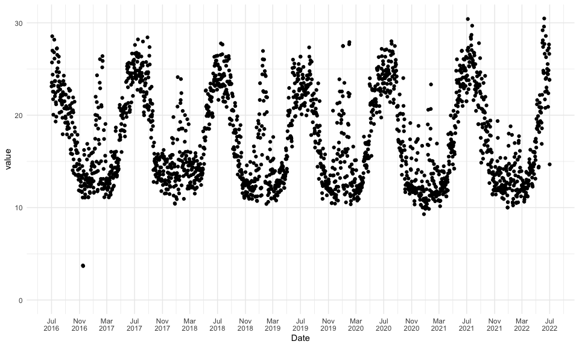
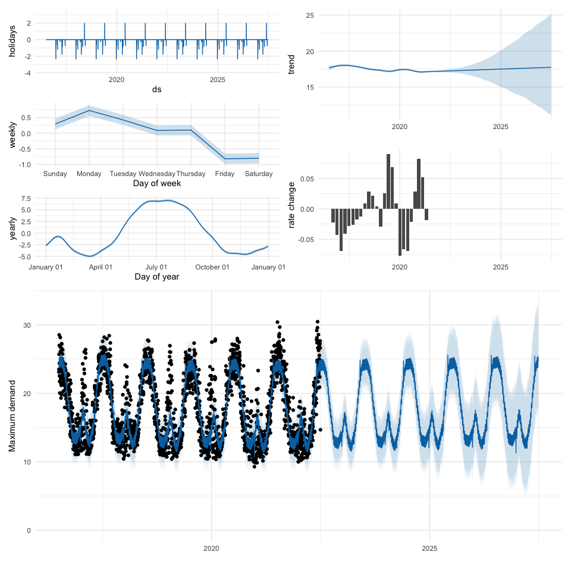

### Document History

Original publish date: 15 Feb 2022

Updated on: 27 Dec 2023

# Introduction

["Prophet is a "procedure" for forecasting time series data based on an additive model where non-linear trends are fit with yearly, weekly, and daily seasonality, plus holiday effects"](https://facebook.github.io/prophet/), with implementations in [R](https://facebook.github.io/prophet/docs/quick_start.html#r-api) and [Python](https://facebook.github.io/prophet/docs/quick_start.html#python-api). It is a "procedure" in the sense that it hides a lot of the technical details, and aims at auto-determining whether e.g. seasonalities and changepoints are present in the data. It also allows for fully Bayesian inference, making use of the [Stan](https://mc-stan.org/) statistical modelling platform. Prophet has an active community, with frequent updates and an [active issue tracker](https://github.com/facebook/prophet/issues) on GitHub. 

In this case study, we want to use the R package `prophet` for forecasting maximum electricity demand. Understanding and being able to forecast maximum electricity demand is important for identifying constraints in an electricity network. With distributed energy resources and behind-the-meter technology changing the landscape of traditional electricity demand, it is even more important to understand how maximum demand changes over time, in order for the energy distributor to be able to ensure overall network stability. Furthermore, under the [Australian Energy Market Commission's (AEMC) National Electricity Rules](https://www.aemc.gov.au/regulation/energy-rules/national-electricity-rules), electricity network service providers are required to routinely provide maximum demand forecasts for their assets. 

This case study shows how easy it is to use `prophet` for (fully Bayesian) time-series forecasting. This is not a comprehensive study, but serves as a starting point for more in-depth work.


# Prerequisities

We start by loading necessary R packages; aside from `prophet`, we make use of the `tidyverse` suite of packages, `lubridate` for easier handling of times and dates, `patchwork` for stitching together (gg)plots, and `tsibble` which provides data for Australian state and territory-specific holidays.


```r
library(tidyverse)
library(lubridate)
library(prophet)
library(patchwork)
library(tsibble)
```

# Data

[Evoenergy](https://www.evoenergy.com.au/) is the electricity and gas distributor in the ACT, which operates and maintains the ACT electricity and gas network. Under the AEMC's National Electricity Rules, [Evoenergy provides raw load data](https://www.evoenergy.com.au/about-us/about-our-network/zone-substation-data) (as apparent power in Mega Volt Amps, MVA) in half hourly intervals for all zone substations. We download and read data from 6 financial years (FY16/17 - FY21/22) for Theodore zone substation (ZSS), which is [located in south Tuggeranong between Theodore and Banks](https://maps.google.com/?q=-35.45970921584446,149.11718976906894). Data are provided as "wide" CSV files, which we reshape from wide to long.


```r
base <- "https://www.evoenergy.com.au/-/media/evoenergy/about-us/zone-substation-data"
url <- paste(
    base,
    c(
        "zone-substation-report-2021-22.csv", 
        "zone-substation-report-2020-21.csv", 
        "zone-substation-report-2019-20.csv",
        "zone-substation-report-2018-19.csv",
        "zone-substation-report-2017-18.csv",
        "zone_substation_report_2016-2017.csv"),
    sep = "/")

# Raw data for Theodore ZSS
name_zss <- "Theodore"
data <- url %>%
    map_dfr(~ .x %>% read_csv() %>% rename(timestamp = 1)) %>%
    pivot_longer(-timestamp) %>%
    filter(name == name_zss) %>%
    mutate(timestamp = dmy_hm(timestamp))
```

We want to model (and forecast) *daily* maximum demand data, so we first determine the maximum load for every day during the last 6 (financial) years and store data in a new `tibble`. This is easily done by grouping entries by year, month and day, and keeping only the maximum value per group using `dplyr::slice_max`. We also add a date column, which is simply the date component of the timestamp and which we will use for plotting.


```r
# Maximum demand per month
data_max <- data %>%
    mutate(
        day = day(timestamp),
        month = month(timestamp, label = TRUE),
        year = year(timestamp),
        date = as.Date(timestamp)) %>%
    group_by(year, month, day) %>%
    slice_max(value) %>%
    ungroup()
```

# Visual inspection of daily maximum demand data

We plot daily maximum demand during the last 6 financial years.


```r
# Inspect
data_max %>%
    ggplot(aes(date, value)) +
    geom_point() +
    scale_x_date(
        name = "Date",
        date_breaks = "4 months",
        date_labels = "%b\n%Y") +
    expand_limits(y = 0) +
    theme_minimal()
```

<!-- -->

We note some interesting (seasonal/periodical) features in the data.

- Generally, maximum demand is highest during the winter months around July. From around September onwards, demand decreases and reaches a minimum during the summer period between November and March of the following year. This dip in load is often interrupted during the hottest summer month(s), often around January, where maximum demand shows a sharp spike. This summer peak demand can be as high or higher than the broader winter maximum, as was the case e.g. in FY19/20. These narrow summer peaks are a result of hot summers' significantly increased electricity demand for running air conditioning and evaporative cooling units.

- We can also see the effects of particularly hot summers on peak electricity demand during the summer months: for example, the 2018/2019 and 2019/2020 summers were Australia's hottest and second-hottest on record, leading to some of the highest electricity demand during those years. By contrast, the summer of 2021/2022 was one of the wettest and coolest summers in a decade, resulting in a very subdued summer electricity peak. 

- We also note that there are some unusual load measurements (outliers) in the data; for example, in November 2016 there was an unrealistically low load measurement of less than 5 MVA. These peculiarities are often the result of errors during the data collection process, and can have undesired effects on estimating the overall load trend; `prophet` can comfortably deal with missing data, and the [recommended way](https://facebook.github.io/prophet/docs/outliers.html) to deal with outliers within `prophet` is to remove them. A word of caution: Outlier data removal can be a slippery slope, so care needs to be taken when removing data.

In this case, we take a conservative approach and remove all data points with unrealistically low daily max loads.


```r
data_max <- data_max %>%
    filter(value > 5)
```

# Fit model

We are now ready to fit a `prophet` model. We want to do full Bayesian inference with $N = 500$ samples to see uncertainties in the seasonal (yearly and monthly) model estimates. Since we have daily data, we set `daily.seasonality = FALSE`. We also allow the model to fit changepoints automatically, which we will inspect after fitting the model. By default, `prophet` considers 25 potential changepoints distributed uniformly across the first 80% of the time series. This may seem like a lot, however an inspection of the rate of change will reveal that many of the changepoints have a small/negligible effect. This is because `prophet` uses a sparse prior, which has a regularising effect on the changepoint coefficients. Lastly, we account for holiday effects by including ACT-specific holidays. 

Fitting a fully Bayesian model takes considerably more time; in this case, expect a full model fit to take around 10-20 minutes. If this is too long, consider setting `n_samples = 0`. Also note that holiday data must be provided for both the past *and* the future, in order to ensure that future predictions account for holiday effects. In this case we want to forecast `n_future = 5` into the future.


```r
n_future <- 5
data_holiday <- data_max %>%
    pull(year) %>%
    c(., max(.) + n_future) %>%
    modelr::seq_range(by = 1) %>%
    holiday_aus(state = "ACT") %>%
    rename(ds = date)
n_samples <- 500      # Use this for slower MCMC sampling
#n_samples <- 0         # Use this for faster MAP estimates
m <- data_max %>%
    select(ds = date, y = value) %>%
    prophet(
        mcmc.samples = n_samples,
        holidays = data_holiday,
        daily.seasonality = FALSE)
```

```
## Warning: Bulk Effective Samples Size (ESS) is too low, indicating posterior means and medians may be unreliable.
## Running the chains for more iterations may help. See
## https://mc-stan.org/misc/warnings.html#bulk-ess
```

```
## Warning: Tail Effective Samples Size (ESS) is too low, indicating posterior variances and tail quantiles may be unreliable.
## Running the chains for more iterations may help. See
## https://mc-stan.org/misc/warnings.html#tail-ess
```

The `prophet` output object is a simple `list`, which holds parameter values, input data, and the Stan fit results.

# Forecast

We are now ready to forecast into the future. We want to show model fit components and forecasts in a single multi-panel plot. Do to this, we first define a custom function `patch` which stitches together the different plot components.


```r
# Custom function to stitch together plots
patch <- function(m, forecast) {
    
    plot_forecast <- plot(m, forecast) + theme_minimal()
    plot_changepoint <- tibble(
        ds = m$changepoints, `rate change` = colMeans(m$params$delta)) %>%
        ggplot(aes(ds, `rate change`)) + 
        geom_col() + 
        labs(x = "") +
        theme_minimal()
    
    # `prophet_plot_components()` always draws a plot. We want to customise
    # the plots and avoid multiple plots in the Rmd output so we send the 
    # output to a temp file and remove. 
    # This is clunky but I haven't found a better way
    t <- tempfile(); pdf(file = t); 
    plot_components <- prophet_plot_components(m, forecast)
    dev.off(); file.remove(t);
    left <- plot_components[-1] %>%
        wrap_plots(ncol = 1)
    right <- wrap_plots(
        plot_components[[1]] + 
            labs(x = ""), 
        plot_changepoint +
            lims(x = range(forecast$ds)), 
        ncol = 1)
    top <- wrap_plots(left, right, ncol = 2)
    bottom <- plot_forecast + 
        labs(x = "", y = "Maximum demand") + 
        expand_limits(y = 0)
    wrap_plots(top, bottom, ncol = 1) &
        theme_minimal()
    
}
```

Predicting maximum demand into the future and showing fit results are then 3 more lines of code.


```r
# Forecast into the future
future <- make_future_dataframe(m, periods = n_future * 365)
forecast <- predict(m, future)
patch(m, forecast)
```

<!-- -->

We can make some interesting observations from the various model output plots. 

1. **Weakly seasonality**: Maximum demand is highest at the beginning of the week, and decreases during the week before reaching its minimum on Friday and Saturday. The load variation from this weekly effect is of the order of 1 MVA, which translates to around 5% of the average load at Theodore ZSS.
2. **Annual seasonality**: On average, maximum demand is highest in winter, with a broad maximum between May and September; maximum demand is lowest during the summer months between November and March of the following year, with an increase in demand during the hottest periods of the year in January/February (the summer peak). This is exactly the same pattern that we already discussed after inspecting the raw data. The variation in low and high maximum demand is of the order of 10 MVA, which is considerable given the average load at Theodore ZSS of 17 MVA.
3. The model proposes a handful of **changepoints**, all with effectively negligible rates of change. We are skipping a thorough model validation step here but a future model fitting iteration should explore the validity and effect of including changepoints on the overall fit quality. For example, in function `prophet::prophet()` the parameter `n.changepoints` allows to specify the number of potential changepoints, and `changepoint.prior.scale` allows to adjust the strength of the sparse prior (a larger value allows for a more flexible changepoint-including trend).
4. The overall **trend** component suggests a near constant average load of 17 MVA at Theodore ZSS over the last 6 years.


# Future work

Obviously, this is a pretty simple "straight-out-of-the-box" model with little to no model validation. As maximum demand is strongly driven by weather effects (primarily maximum and minimum temperatures in summer and winter, respectively), an improvement to the model would be to include temperature as an external regressor. Maximum demand forecasts would then require temperature forecasts as an input. Additionally, changes to the electricity network topology as a result of network upgrades may lead to significant changes in base load at specific points of the electricity network. Theodore ZSS shows a pretty constant base load over the last 6 years but the situation may be very different for other zone substations in areas that e.g. are undergoing rapid urban densification. 
