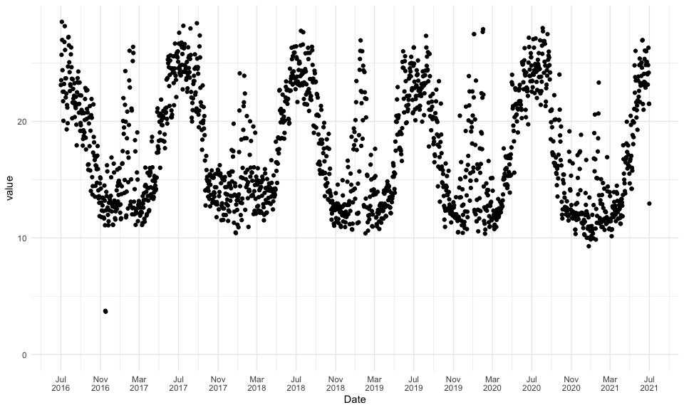
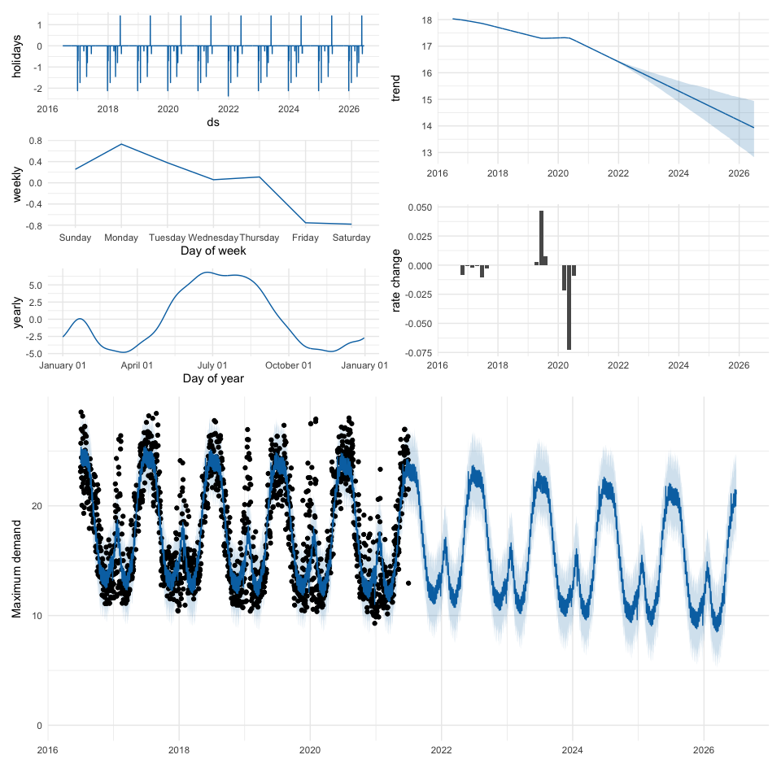

# Introduction

\[…\]

-   Prophet
-   Maximum demand

# Prerequisities

We start by loading necessary R packages; aside from `prophet`, we make
use of the `tidyverse` suite of packages, `lubridate` for easier
handling of times and dates, `patchwork` for stichting together
(gg)plots, and `tsibble` which provides data for Australian state and
territory-specific holidays.

``` r
library(tidyverse)
library(lubridate)
library(prophet)
library(patchwork)
library(tsibble)
```

# Data

Evoenergy is the electricity and gas distributor in the ACT, which
operates and maintains the ACT electricity and gas network. Under the
National Electricity Rules, Evoenergy provides raw load data (in MVA) in
half hourly intervals for all zone substations. We download and read
data from the last 5 financial years (FY16/17 - FY20/21) for Theodore
zone substation, which is located in south Tuggeranong between Theodore
and Banks. Data are provided in “wide” CSV files, which we reshape from
wide to long.

``` r
base <- "https://www.evoenergy.com.au/-/media/evoenergy/about-us/zone-substation-data"
url <- paste(
    base,
    c(
        "zone-substation-report-2020-21.csv", 
        "zone-substation-report-2019-20.csv",
        "zone-substation-report-2018-19.csv",
        "zone-substation-report-2017-18.csv",
        "zone_substation_report_2016-2017.csv"),
    sep = "/")

# Raw data for Theodore ZSS
name_zss <- "Theodore"
data <- url %>%
    map_dfr(~ .x %>% read_csv() %>% rename(timestamp = 1)) %>%
    pivot_longer(-timestamp) %>%
    filter(name == name_zss) %>%
    mutate(timestamp = dmy_hm(timestamp))
```

We want to model (and forecast) *daily* maximum demand data, so we first
determine the maximum load for every day of the last 5 (financial) years
and store data in a new `tibble`. This is easily done by grouping
entries by year, month and day, and keeping only the maximum value per
group using `dplyr::slice_max`. We also add a date column, which is
simply the date component of the timestamp.

``` r
# Maximum demand per month
data_max <- data %>%
    mutate(
        day = day(timestamp),
        month = month(timestamp, label = TRUE),
        year = year(timestamp),
        date = as.Date(timestamp)) %>%
    group_by(year, month, day) %>%
    slice_max(value) %>%
    ungroup()
```

# Visual inspection of daily maximum demand data

We plot daily maximum demand during the last 5 financial years.

``` r
# Inspect
data_max %>%
    ggplot(aes(date, value)) +
    geom_point() +
    scale_x_date(
        name = "Date",
        date_breaks = "4 months",
        date_labels = "%b\n%Y") +
    expand_limits(y = 0) +
    theme_minimal()
```

<!-- -->

We can clearly make out some interesting (seasonal/periodical) patterns:
Generally maximum demand is high during the winter months around July.
From September onwards, demand decreases and reaches a minimum during
the summer period between November and March of the following year. This
minimum is interrupted during the hottest summer month(s), often around
January, where maximum demand shows a sharp spike. This summer peak
demand can be as high as the broader winter maximum, as was the case
e.g. in FY19/20.

We also note that there are some clear outliers in the data. These
outliers can have undesired effects on estimating the overall trend;
`prophet` can comfortably deal with missing data, and the [recommended
way](https://facebook.github.io/prophet/docs/outliers.html) to deal with
outliers within `prophet` is to remove them. A word of caution: Outlier
removal can be a slippery slope, so care needs to be taken when removing
data.

In this case, we take a conservative approach and remove the two data
points with unrealistically low load in November 2016.

``` r
data_max <- data_max %>%
    filter(value > 5)
```

# Fit model

We are now ready to fit a `prophet` model. We want to do full Bayesian
inference with *N* = 2000 samples to see uncertainties in the seasonal
(yearly and monthly) model estimates. Since we have daily data, we set
`daily.seasonality = FALSE`. We also allow the model to fit changepoints
automatically, which we will inspect after fitting the model. By
default, `prophet` considers 25 potential changepoints distributed
uniformly across the first 80% f the time series. This may seem like a
lot, however an inspection of the rate of change will reveal that many
of the changepoints have a small/negligible effect. This is because
`prophet` uses a sparse prior, which has a regularising effect on the
changepoint coefficients. Lastly, we account for holiday effects by
including ACT-specific holidays.

Fitting a fully Bayesian model takes considerably more time; in this
case, expect a full model fit to take around 10-20 minutes. If this is
too long, consider setting `n_samples = 0`. Also note that holiday data
must be provided for both the past *and* the future, in order to ensure
that future predictions account for holiday effects. In this case we
want to forecast `n_future = 5` into the future.

``` r
n_future <- 5
data_holiday <- data_max %>%
    pull(year) %>%
    c(., max(.) + n_future) %>%
    modelr::seq_range(by = 1) %>%
    holiday_aus(state = "ACT") %>%
    rename(ds = date)
#n_samples <- 2000      # Use this for slower MCMC sampling
n_samples <- 0         # Use this for faster MAP estimates
m <- data_max %>%
    select(ds = date, y = value) %>%
    prophet(
        mcmc.samples = n_samples,
        holidays = data_holiday,
        daily.seasonality = FALSE)
```

The `prophet` output object is a simple `list`, which holds parameter
values, input data, and the Stan fit results.

# Forecast

We are now ready to forecast into the future. We want to show model fit
components and forecasts in a single multi-panel plot. Do to this, we
first define a custom function `patch` which stitches together the
different fit components.

``` r
# Custom function to stitch together plots
patch <- function(m, forecast) {
    
    plot_forecast <- plot(m, forecast) + theme_minimal()
    plot_changepoint <- tibble(
        ds = m$changepoints, `rate change` = colMeans(m$params$delta)) %>%
        ggplot(aes(ds, `rate change`)) + 
        geom_col() + 
        labs(x = "") +
        theme_minimal()
    
    # `prophet_plot_components()` always draws a plot. We want to customise
    # the plots and avoid multiple plots in the Rmd output so we send the 
    # output to a temp file and remove. 
    # This is clunky but I haven't found a better way
    t <- tempfile(); pdf(file = t); 
    plot_components <- prophet_plot_components(m, forecast)
    dev.off(); file.remove(t);
    left <- plot_components[-1] %>%
        wrap_plots(ncol = 1)
    right <- wrap_plots(
        plot_components[[1]] + 
            labs(x = ""), 
        plot_changepoint +
            lims(x = range(forecast$ds)), 
        ncol = 1)
    top <- wrap_plots(left, right, ncol = 2)
    bottom <- plot_forecast + 
        labs(x = "", y = "Maximum demand") + 
        expand_limits(y = 0)
    wrap_plots(top, bottom, ncol = 1) &
        theme_minimal()
    
}
```

Predicting maximum demand into the future and showing fit results are
then 3 more lines of code.

``` r
# Forecast into the future
future <- make_future_dataframe(m, periods = n_future * 365)
forecast <- predict(m, future)
patch(m, forecast)
```

<!-- -->

We can make some interesting observations from the model fit.

1.  **Weakly seasonality**: Maximum demand is highest at the beginning
    of the week, and decreases during the week before reaching its
    minimum on Friday and Saturday. The load variation from this weekly
    effect is of the order of 1 MVA, which translates to around 5% of
    the typical load at Theodore ZSS.
2.  **Annual seasonality**: Maximum demand is highest in winter, with a
    broad maximum between May and September. Maximum demand is lowest
    during the summer months between November and March of the following
    year, with an increase in maximum demand during the hottest periods
    of the year in January/February. This is exactly the same pattern
    that we already discussed after inspecting the raw data. The
    variation in low and high maximum demand is of the order of 10 MVA.
3.  The model proposes a handful of changepoints, most with negligible
    rates of change. The model estimates the biggest changes to the
    trend to occur in spring 2019 and autumn 2020. This can be seen in
    the trend component, which flattens between Spring 2019 and Autumn
    2020, before continuing on a steeper downward trajectory.
4.  
